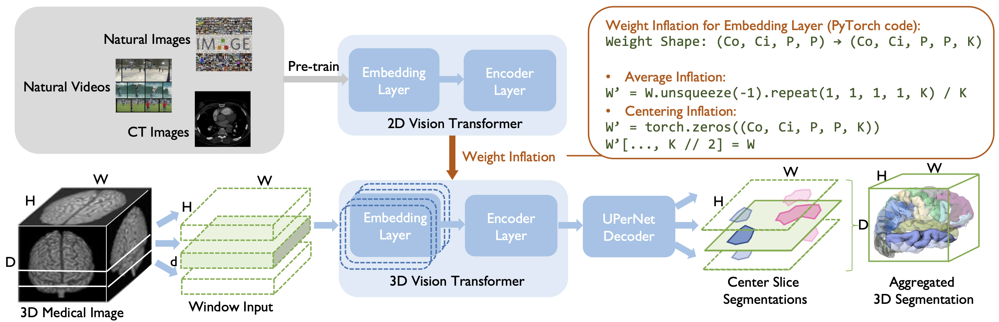

# Weight Inflation is All You Need: Adapting Pre-trained Vision Transformers to 3D Medical Image Segmentation

[](https://lbesson.mit-license.org/)
[](https://www.python.org/downloads/release/python-3811/)
[](https://pytorch.org/get-started/previous-versions/#v171)
[](https://pytorch-lightning.readthedocs.io/en/1.4.9/)

This repo provides the PyTorch source code of our paper: 
Weight Inflation is All You Need: Adapting Pre-trained Vision Transformers to 3D Medical Image Segmentation (MICCAI 2022 (Under Review)). 

## Abstract

*Recently, Transformer-based models have started to achieve state-of-the-art performances across many vision tasks, through pre-training on large-scale natural image benchmark datasets. These improvements have motivated recent works on medical image segmentation to explore Transformer-based models. However, direct use of pre-trained Transformers is non-trivial due to the dimensional difference between 2D natural images and 3D medical images. One line of works splits 3D images into 2D slices and predicts each slice independently, thereby losing depth information; another line of works modifies the Transformer architecture to support 3D inputs but randomly initialize the model at the expense of transfer learning. In this work, we investigate the effectiveness of transfer learning from different pre-training sources and objectives, and present a simple yet effective weight inflation strategy to adapt pre-trained Transformers from 2D to 3D to exploit the depth information. Our best practice achieves consistent improvements and many state-of-the-art performances on twelve 3D medical image datasets with a few lines of code modification and less than 1% increase in computational cost.*

## Approach


**Figure: Approach overview. Large-scale pre-trained Transformers are used as the encoder in the segmentation model for transfer learning, in which weights are adapted using the inflation strategy to support 3D inputs. Each 3D image is split into windows, which contain a small number of neighbor slices. Each window is fed into the segmentation model and the segmentation of the center slice is predicted. All the predicted slices are aggregated to form the final 3D prediction.**

## Getting Started

### Installation

Please install dependencies by

```bash
conda env create -f environment.yml
```

### Dataset and Model

- We use the **[BCV](https://www.synapse.org/\#!Synapse:syn3193805/wiki/217789)**, **[ACDC](https://www.creatis.insa-lyon.fr/Challenge/acdc/)**, **[MSD](https://drive.google.com/file/d/1jzeNU1EKnK81PyTsrx0ujfNl-t0Jo8uE/view?usp=sharing)** dataset, please register and download these datasets.
- Decompress each dataset and move it to the corresponding the `src/data/` folder (e.g., move **BCV** to `src/data/bcv/`)
- Run the pre-processing script *split_data_to_slices_nii.py* in each folder to generate processed data. (e.g., **BCV** will be processed to `src/data/bcv/processed/`).
- Run the weight downloading script *download_weights.sh* in the `src/backbones/encoders/pretrained_models/`folder.

### Training

1. To train the best segmentation model with both transfer learning and depth information (i.e., **Ours** in the paper), run:

```bash
cd src/
bash scripts/train_[dataset].sh
```

All the hardward requirements for training such as number of GPUs, CPUs, RAMs are listed in each script.

To change the dataset, modify `--data_dir`

To change the different encoder, set `--encoder swint/videoswint/dino`.

To adjust the number of training steps, set `--max_steps 250000`.

2. To train the segmentation model with only transfer learning and without depth information (i.e., **Ours w/o D** in the paper), simply add `--force_2d 1` and run:

```bash
cd src/
# add `--force_2d 1` at the end of the script
bash scripts/train_[dataset].sh
```

3. To train the segmentation model without transfer learning or depth information (i.e., **Ours w/o T&D** in the paper), simply add `--use_pretrained 0` and run:

```bash
cd src/
# add both `--force_2d 1` and `--use_pretrained 0` at the end of the script
bash scripts/train_[dataset].sh
```

Results are displayed at the end of training and can also be found at `wandb/` (open with `wandb` web or local client).

Model files are saved in `MedicalSegmentation/` folder. 

4. To reproduce UNETR baseline, follow the tutorial of the **official UNETR release** and set the correct training and validation set:

```
https://github.com/Project-MONAI/tutorials/blob/master/3d_segmentation/unetr_btcv_segmentation_3d_lightning.ipynb
```

Will clean and integrate UNETR codes in the final code release.

### Evaluation

To evaluate any trained segmentation model, simply add `--evaluation 1` and `--model_path <path/to/checkpoint>` and run:

```bash
cd src/
# add `--evaluation 1` and `--model_path <path/to/checkpoint>` at the end of the script
bash scripts/train_[dataset].sh
```

Results are displayed at the end of evaluation and can also be found at `wandb/` (open with `wandb` web or local client).

The predictions are saved in `dumps/` (open with `pickle.Unpickler`) .

### Compute FLOPS

To compute the FLOPS of the vanilla Transformer and inflated Transformer, simply run:

```bash
cd src/
python compute_flops.py
```

Should get `2D FLOPS: 213343401984` and `3D FLOPS: 214954014720`, which indicates there is little increased computational cost of our method.

## Citation
If you use this repo in your research, please cite it as
follows *(Under Submission)*. :
```
@inproceedings{
  anonymous2022weight,
  title={Weight Inflation is All You Need: Adapting Pre-trained Vision Transformers to 3D Medical Image Segmentation},
  author={Anonymous},
  booktitle={Submitted to 25th International Conference on Medical Image Computing and Computer Assisted Intervention},
  year={2022},
  note={under review}
}
```